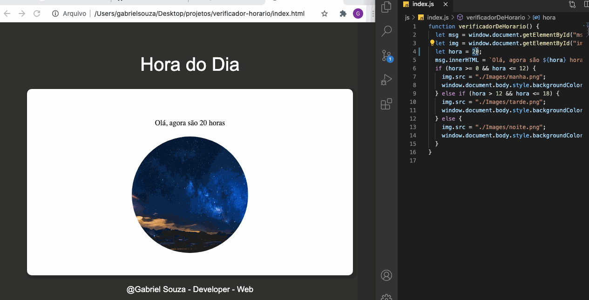

<html>
   <body>
  <h1 align="center">Verificador de Horario</h1>
<h4 align="center">
   
</h4>

Desenvolvi esse pequeno projeto em java script para ganhar mais conhecimento e sempre melhorar forma de programar na linguagem. Com isso criei um pequeno projeto que vai verificar o horário de acordo com horário da sua maquina ou seja seu computador, e nisso ele vai mostrar uma imagem e vai mudar o tema de acordo com o seu horário. vou fazer uma pequena demonstração no código abaixo.
<table>
  <tr>
    <td align="center"><a href="https://github.com/Gabriel200395"> <b>Gabriel Souza</b></a> </td>
  <tr>
</table>

